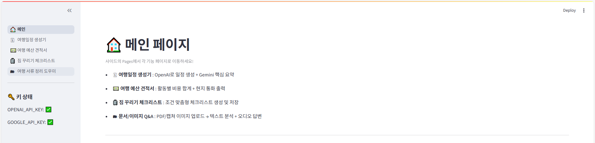
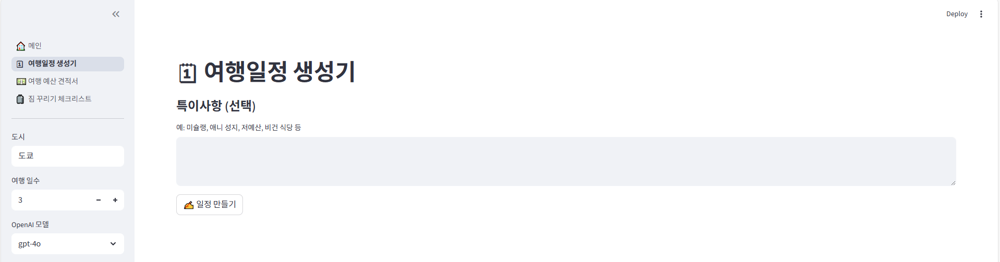
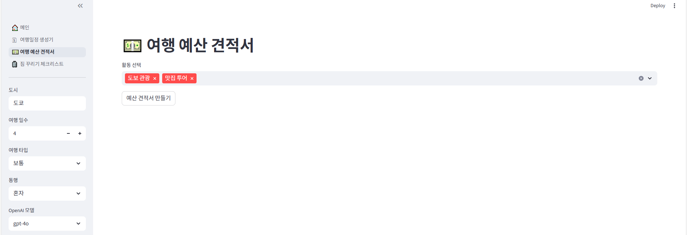
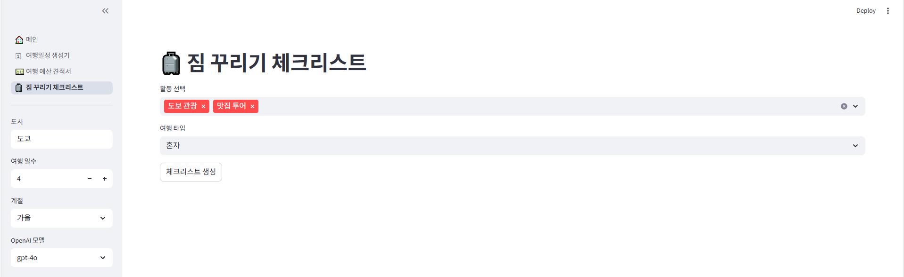
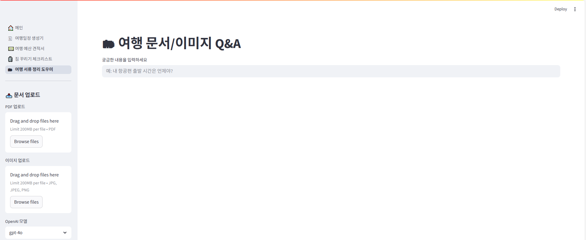

# ✈️ 여행 어시스턴트 웹앱

> **AI 기반 여행 플래너**  
> OpenAI & Google Gemini 모델을 활용한 Streamlit 기반 **여행 어시스턴트 웹앱**입니다.  
>  **✍️ 여행 일정**  **💵 예산**  **🧳 짐 꾸리기**  **🗂 문서/이미지 Q&A** 를 한 번에 해결하세요!

---
## Streamlit URL
> **https://aiproject-ndzmvd4rlhdvvu6k7q5re8.streamlit.app/**
---

---
## 🖼️ Preview
> **https://www.youtube.com/watch?v=FsV-a8KtSvs**


<p align="center">
  
</p>

---

## 📊 Badges

<p align="center">
  
  
  
  
  
</p>

---

## 📂 프로젝트 구조

```
.
├── app.py               
├── main.py              # 메인 페이지
├── p1.py                # 여행 일정 생성기
├── p2.py                # 여행 예산 견적서
├── p3.py                # 짐 꾸리기 체크리스트
├── p4.py                # 문서/이미지 Q&A (PDF + 캡쳐 이미지 지원)
├── utils.py             # 공용 함수 
├── txt/                 # 체크리스트 결과 저장
├── audio/               # 오디오 파일 저장
├── docs/
├── .env                 # API Key (OPENAI_API_KEY, GOOGLE_API_KEY)                
└── requirements.txt     # 필요 패키지 목록


```

---

## 🚀 실행 방법

```bash
# 1. 프로젝트 클론
git clone https://github.com/your-username/your-repo.git
cd your-repo

# 2. 가상환경 생성 및 실행
python -m venv venv
source venv/bin/activate   # Mac/Linux
venv\Scripts\activate      # Windows

# 3. 패키지 설치
pip install -r requirements.txt

# 4. 환경 변수(.env) 설정
OPENAI_API_KEY=your_openai_api_key
GOOGLE_API_KEY=your_google_api_key

# 5. Tesseract OCR 설치 (이미지 텍스트 추출용)
# Windows: https://github.com/UB-Mannheim/tesseract/wiki
# 설치 후, PATH 등록 또는 utils.py에 경로 지정 필요
# 예시:
# pytesseract.pytesseract.tesseract_cmd = r"C:\Program Files\Tesseract-OCR\tesseract.exe"

# 6. 실행
streamlit run app.py
```

---

## ✨ 주요 기능

### 🗓 여행 일정 생성기
- 도시 & 여행 일수 입력 → 현실적인 일정 자동 생성
- Gemini로 핵심 요약 제공

### 💵 여행 예산 견적서
- 교통/숙박/식사/관광/기타 **항목별 예산 합계**
- 현지 통화 기준 출력 + 총합 계산
- 절약 팁 & 리스크 안내

### 🧳 짐 꾸리기 체크리스트
- 조건에 맞는 짐 목록 자동 생성
- 체크박스 UI 제공
- 결과를 **txt 폴더에 저장** + 다운로드 버튼 제공

### 🗂 문서/이미지 Q&A
- PDF 업로드 + 캡쳐 이미지(JPG, PNG) 업로드 지원
- OCR(Tesseract)로 이미지 속 텍스트 추출
- 질문 → 답변 출력 + 오디오(mp3)로 안내

---

## 📸 Screenshots

<p align="center">
  
  
</p>

<p align="center">
  
  
</p>

---

## 🛠 Tech Stack

- [Python](https://www.python.org/) 3.10+
- [Streamlit](https://streamlit.io/)
- [OpenAI API](https://platform.openai.com/)
- [Google Gemini](https://ai.google.dev/)
- [Tesseract OCR](https://github.com/tesseract-ocr/tesseract)

---


